# 《The Illustrated Transformer》中文原理精讲

本文根据 Jay Alammar 的 [The Illustrated Transformer](https://jalammar.github.io/illustrated-transformer/) 整理。图片来自原文正文，文字部分改写为中文教程，目标是让没有编程和机器学习背景的读者也能一步步理解 Transformer 的核心原理，并在关键地方补上必要的数学解释。

先约定几个最基础的符号。一个句子可以看成一串词，比如 `The animal didn't cross the street`。模型不能直接处理文字，所以会把每个词变成一串数字，这串数字叫向量。很多个词的向量排成表格，就叫矩阵。如果一个句子有 $n$ 个词，每个词用 $d_{model}$ 个数字表示，那么输入矩阵可以写成：

$$
X \in \mathbb{R}^{n \times d_{model}}
$$

其中 $n$ 是词的个数，$d_{model}$ 是每个词向量的长度。原始 Transformer 常用 $d_{model}=512$。后面看到 Q、K、V、softmax、残差连接、归一化、交叉熵时，都可以把它们理解成“把这张数字表格变成更有用的数字表格”的步骤。

## 1. Transformer 先是一台翻译机器

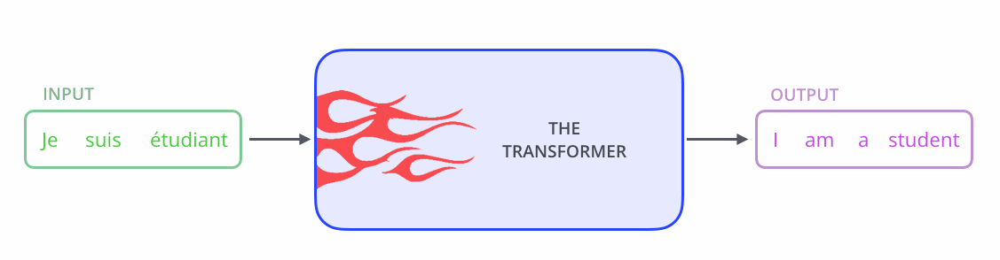

从最高层看，Transformer 可以先被当成一个黑盒。输入是一句话，输出是另一句话。机器翻译是最直观的例子：输入法语句子，输出英语句子。

这个黑盒真正要完成的事情并不是简单查词典。翻译一句话时，模型要理解词义、词序、指代关系、修饰关系，还要按目标语言的语法重新组织表达。例如 “it was too tired” 里的 `it` 指的是 `animal`，这不是逐词替换能解决的。

所以 Transformer 的本质可以先概括成两件事：

1. 把输入句子变成机器内部能理解的表示。
2. 根据这个表示，一步步生成目标句子。

这个“表示”不是某个中文或英文句子，而是一堆数字。模型学习的过程，就是让这些数字越来越能表达语言中的含义和关系。

## 2. 编码器负责读，解码器负责写

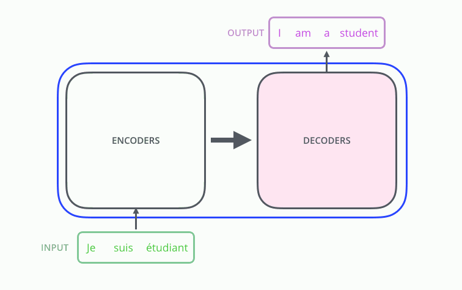

打开黑盒后，会看到两个大模块：编码器和解码器。编码器负责读取输入句子，把它加工成一组上下文表示；解码器负责根据这些表示生成输出句子。

可以把编码器理解成阅读员。阅读员不是把句子逐字翻译，而是先读懂：谁做了什么，哪个词修饰哪个词，代词指代谁，句子大概表达什么。解码器像写作员，它拿着阅读员整理好的信息，再用目标语言一个词一个词写出答案。

用数学语言说，编码器把输入矩阵 $X$ 变成一个新的矩阵 $H$：

$$
H = Encoder(X)
$$

$H$ 仍然是一张数字表，但每一行不再只是某个词的原始数字身份证，而是融合了上下文之后的表示。解码器会利用 $H$ 和已经生成的词，预测下一个词：

$$
p(y_t \mid y_{<t}, X) = Decoder(y_{<t}, H)
$$

这里 $y_t$ 表示第 $t$ 个要生成的词，$y_{<t}$ 表示它前面已经生成的词。

## 3. 多层堆叠不是装饰，而是逐步抽象

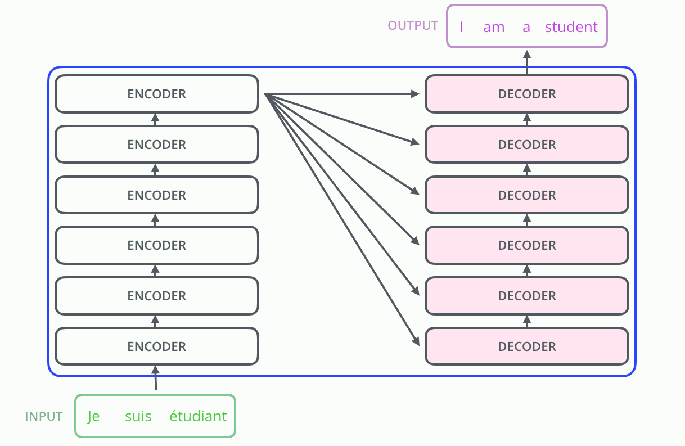

原始 Transformer 使用 6 层编码器和 6 层解码器。这个数字不是定律，而是一种工程选择。层数可以变多，也可以变少，但堆叠的思想非常重要。

第一层可能更接近词本身，比如词形、局部搭配。中间层可能开始捕捉短语关系、指代关系。更高层可能形成更抽象的句意表示。虽然我们不能简单说“第几层一定学什么”，但多层结构给了模型反复加工信息的机会。

设第 $l$ 层的输入是 $X^{(l)}$，这一层输出是：

$$
X^{(l+1)} = \mathrm{EncoderLayer}_l(X^{(l)})
$$

经过多层后得到：

$$
H = X^{(6)}
$$

直观地说，每一层都在上一层的理解基础上继续修正。就像人读复杂句子时，第一遍先看大意，第二遍确认关系，第三遍理解深层含义。

## 4. 编码器的一层由自注意力和前馈网络组成

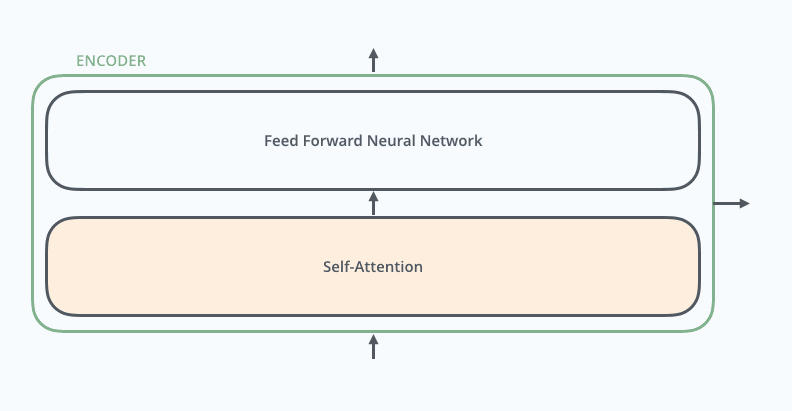

每个编码器层主要有两个核心子层：自注意力层和前馈神经网络层。自注意力层解决“当前词应该参考句子里的哪些词”这个问题。前馈网络对每个位置的向量做进一步非线性加工。

一层编码器可以简化成：

$$
U = SelfAttention(X)
$$

$$
Y = FeedForward(U)
$$

真实结构还会在这两个子层周围加残差连接和归一化，后面会单独展开。现在先抓主线：自注意力负责让词与词之间交换信息，前馈网络负责对交换后的信息进行更深加工。

这里的“交换信息”不是说词真的互相聊天，而是每个词都会重新计算自己的新向量。计算时，它会给句子里的每个词分配一个注意力权重，再把这些词携带的信息按权重混合进来。对第 $i$ 个词来说，可以先把过程写成一个简化公式：

$$
z_i = \sum_{j=1}^{n}\alpha_{ij}v_j
$$

其中 $z_i$ 是第 $i$ 个词更新后的表示，$v_j$ 是第 $j$ 个词能提供的信息，$\alpha_{ij}$ 是第 $i$ 个词分给第 $j$ 个词的注意力比例。比如理解 `it` 时，如果模型认为 `animal` 很重要，就让 $\alpha_{it,animal}$ 大一些；如果 `street` 不重要，就让对应权重小一些。这样 `it` 的新向量里就会混入更多 `animal` 的信息。

前馈网络接着处理每个词的新向量。它不像自注意力那样让词与词互相参考，而是对每个位置单独做一次“再加工”。可以把自注意力看成开会交流信息，把前馈网络看成每个人拿着会议记录回到座位上整理自己的笔记。

前馈网络常见形式是：

$$
FFN(x) = \max(0, xW_1 + b_1)W_2 + b_2
$$

这里 $\max(0,\ldots)$ 叫 ReLU，它会把负数截成 0，正数保留下来。通俗地说，它像一个简单的开关：有用的正信号可以继续往后传，负信号先按 0 处理。这个“开关”让网络不只是做直线式计算，而能表达更复杂的弯曲关系。如果没有 ReLU 这类非线性，多层线性变换叠起来仍然只等价于一次线性变换，表达能力会很弱。

残差连接可以理解成“保留原稿再修改”。如果某个子层输入是 $x$，子层加工结果是 $Sublayer(x)$，残差连接会把两者相加：

$$
x + Sublayer(x)
$$

这样模型不会被迫完全丢掉原来的词向量，而是在原信息上补充新信息。对于很深的网络，这很重要，因为信息要穿过很多层，残差连接给原始信息留了一条更直接的通路。

归一化可以理解成“把每次加工后的数字整理到稳定尺度”。神经网络里每个向量有很多数字，有时某些数字会变得很大，有时整体又太小。层归一化会先看同一个词向量内部的数字，把它们调整到更平稳的范围，再交给下一步。这样后面的计算不容易因为数值忽大忽小而训练不稳定。

## 5. 解码器多了一个看输入句子的注意力层

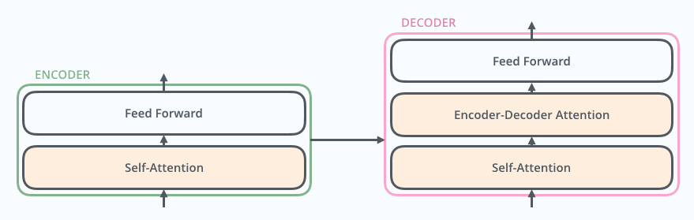

解码器也有自注意力和前馈网络，但中间多了一个编码器-解码器注意力层。它的作用是：生成目标句子时，让解码器回头看输入句子的相关部分。

解码器里的第一层自注意力看的是“已经生成的目标词”。例如已经生成了 `I am`，下一步要预测 `a` 或 `student`，模型需要知道前面写了什么。中间的编码器-解码器注意力看的是输入句子。例如翻译 `je suis étudiant` 时，写到 `student` 附近，模型要重点参考输入里的 `étudiant`。

所以解码器同时处理两类信息：

1. 输出端已经写出的内容，保证句子连贯。
2. 输入端编码后的内容，保证翻译忠实。

如果只看已经写出的词，它可能写得通顺但偏离原文；如果只看原文，它可能不知道目标句子已经写到哪一步。两者都需要。

## 6. 词嵌入：把文字变成可学习的数字坐标

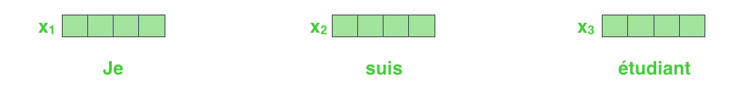

模型处理的第一步是把词变成向量，这叫词嵌入。向量可以先理解成“一排有顺序的数字”。例如：

$$
[0.12,\ -0.38,\ 0.74,\ 0.05]
$$

这就是一个 4 维向量，因为它里面有 4 个数字。每个数字都可以理解成一个隐藏特征的强弱，只是这些特征通常不是人手工命名的。模型不会直接把第 1 维规定成“动物性”、第 2 维规定成“动作性”，而是在训练中自己学出一套有用的数字坐标。两个词的向量越接近，往往说明它们在训练语料中的用法或含义有某些相似之处。

假设词表里有 $V$ 个词，每个词用 $d_{model}$ 个数字表示，那么词嵌入表就是：

$$
E \in \mathbb{R}^{V \times d_{model}}
$$

输入词会先变成一个编号。比如 `animal` 是第 2351 个词，那么模型就从嵌入表中取第 2351 行作为它的向量：

$$
x_{animal} = E[2351]
$$

用 `je suis étudiant` 举一个完整但小尺寸的例子。真实 Transformer 常用 512 维甚至更高维向量，为了看清楚，这里只假设每个词用 4 个数字表示。

第一步，先把句子切成 token：

$$
[\text{je},\ \text{suis},\ \text{étudiant}]
$$

第二步，查词表，把每个 token 变成编号。假设词表里有这样的编号：

| token | 编号 |
| --- | ---: |
| `je` | 17 |
| `suis` | 83 |
| `étudiant` | 241 |

第三步，去嵌入表 $E$ 里取对应行。假设训练到某个时刻，嵌入表中这三行是：

| token | 向量 |
| --- | --- |
| `je` | $[0.20,\ -0.10,\ 0.70,\ 0.05]$ |
| `suis` | $[0.55,\ 0.30,\ -0.20,\ 0.80]$ |
| `étudiant` | $[-0.40,\ 0.90,\ 0.10,\ 0.60]$ |

那么整句话就会被转换成一个矩阵：

$$
X =
\begin{bmatrix}
0.20 & -0.10 & 0.70 & 0.05 \\
0.55 & 0.30 & -0.20 & 0.80 \\
-0.40 & 0.90 & 0.10 & 0.60
\end{bmatrix}
$$

这个矩阵有 3 行 4 列。3 行对应 3 个 token，4 列对应每个 token 的 4 个数字特征。真实模型里，如果 $d_{model}=512$，那 `je suis étudiant` 会变成一个 $3 \times 512$ 的矩阵。

再看一个“相似词靠近”的直觉例子。假设训练后有这些教学用向量：

$$
x_{student}=[-0.38,\ 0.88,\ 0.12,\ 0.61]
$$

$$
x_{teacher}=[-0.35,\ 0.81,\ 0.18,\ 0.58]
$$

$$
x_{banana}=[0.91,\ -0.44,\ 0.03,\ -0.72]
$$

`student` 和 `teacher` 都和学校、人物身份有关，它们的向量数字比较接近；`banana` 是水果，使用场景不同，向量就离得远。模型判断“远近”时常用点积或余弦相似度。例如余弦相似度大致看两个向量方向是否接近：

$$
\cos(a,b)=\frac{a\cdot b}{\|a\|\|b\|}
$$

方向越接近，值越接近 1；越不相关，值越小，甚至可能为负。

这不是人工规定的词典解释，而是训练出来的数字位置。训练刚开始时，这些向量可能接近随机；训练过程中，如果 `cat`、`dog`、`animal` 经常出现在相似语境里，它们的向量会逐渐形成某种相近关系。

为什么数字能表达语义？因为模型的目标会不断推动这些数字变得有用。假如模型翻译错了，损失函数会告诉它错在哪里，反向传播会调整嵌入表和其他权重。久而久之，能帮助预测正确答案的数字结构会被保留下来。

## 7. 每个词都有自己的向量路径

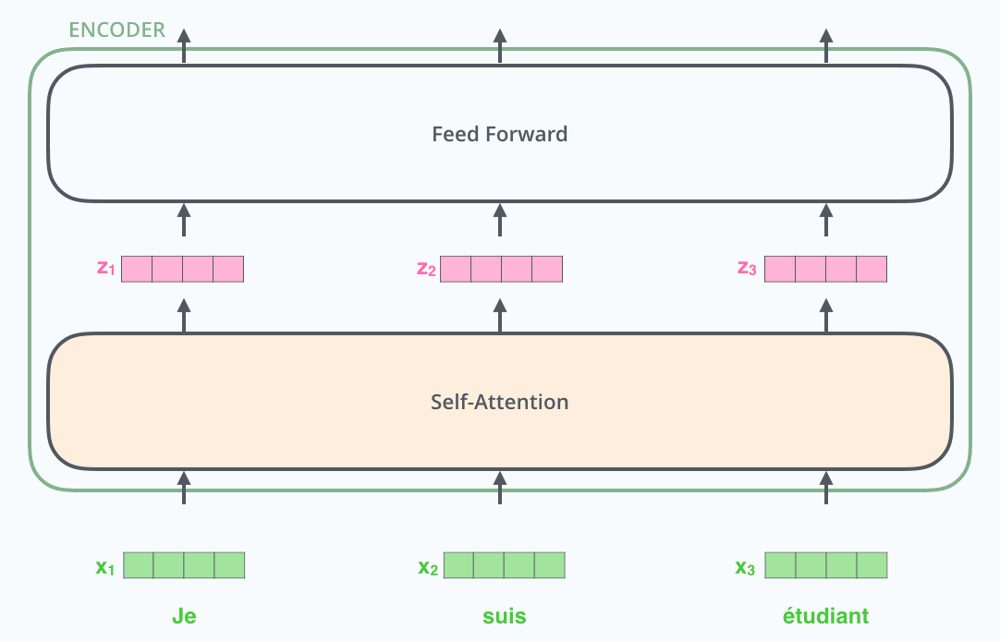

输入句子中每个词都会变成一个向量，然后进入编码器。最底层编码器接收词嵌入；上一层编码器接收下一层编码器输出的上下文向量。

如果一句话有 $n$ 个词，编码器输入是：

$$
X = [x_1, x_2, ..., x_n]
$$

其中每个 $x_i$ 都是长度为 $d_{model}$ 的向量。经过第一层之后，得到：

$$
X' = [x'_1, x'_2, ..., x'_n]
$$

重点是，$x'_i$ 不只是第 $i$ 个词自己的信息，而是融合了句子里其他词的信息。比如 `it` 的新向量可以混入 `animal` 和 `tired` 的信息，这样它就不再是孤零零的代词，而是“当前句子中指向动物且和疲惫有关的 it”。

## 8. Transformer 的并行优势

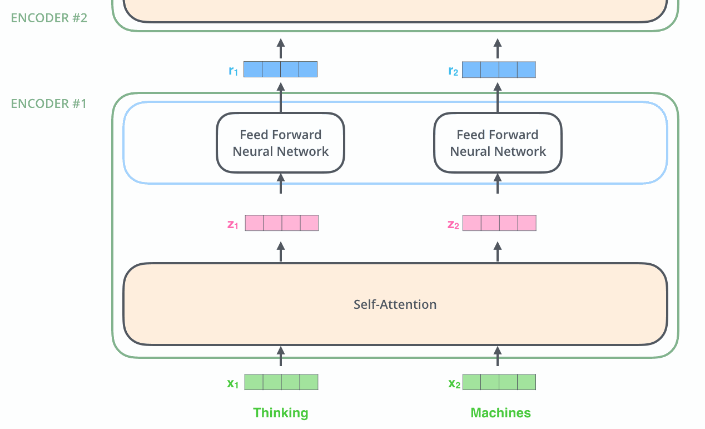

Transformer 的一个重要优势是适合并行计算。传统循环神经网络往往按顺序处理：先读第 1 个词，再读第 2 个词，再读第 3 个词。后面的计算依赖前面的结果，所以很难完全同时进行。

Transformer 的自注意力可以一次性计算所有词之间的关系。它不是先处理完第一个词再处理第二个词，而是把所有词放进同一张矩阵，直接算出“每个词对每个词的关注程度”。

如果句子长度是 $n$，自注意力会形成一个 $n \times n$ 的注意力矩阵：

$$
A_{ij} = \text{第 i 个词关注第 j 个词的程度}
$$

这张矩阵可以由硬件并行计算。代价是，如果句子很长，$n \times n$ 会变大，所以普通自注意力的时间和显存开销大约随 $n^2$ 增长。这也是后来很多长文本 Transformer 改进工作的出发点。

## 9. 自注意力的核心问题：当前词该看谁

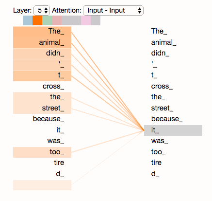

句子 “The animal didn't cross the street because it was too tired” 中，`it` 到底指 `animal` 还是 `street`？人很容易判断是动物，因为街道不会疲惫。模型必须从数据里学会这种关联。

自注意力做的事情就是为每个词计算一组权重：

$$
\alpha_{ij} = \text{第 i 个词理解自己时分给第 j 个词的信息比例}
$$

当 $i$ 是 `it`，模型可能给 `animal` 较大的权重，给 `street` 较小的权重。新的 `it` 向量就会吸收更多来自动物的信息。

这不是硬编码规则。模型不是被人写死“it 一定指最近的名词”或“疲惫只能修饰动物”。它通过大量训练样本学出一套打分机制，判断哪些词之间更应该交换信息。

## 10. Query、Key、Value：把一个词拆成三种用途

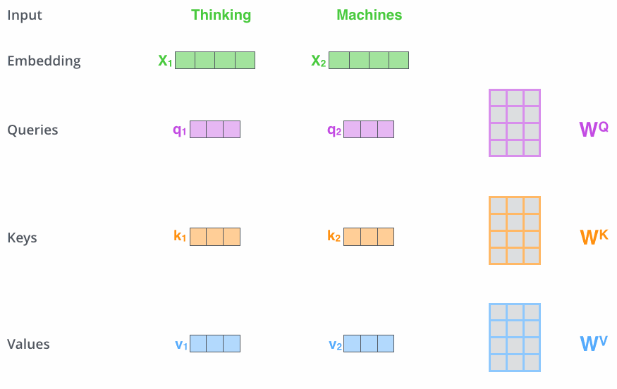

自注意力的第一步，是把每个词向量分别变成 Query、Key、Value 三个向量：

$$
q_i = x_i W^Q
$$

$$
k_i = x_i W^K
$$

$$
v_i = x_i W^V
$$

如果输入矩阵是 $X$，一次性写成矩阵形式就是：

$$
Q = XW^Q,\quad K = XW^K,\quad V = XW^V
$$

这三个名字可以这样理解。Query 是“我想找什么”，Key 是“我身上有什么可匹配的标签”，Value 是“如果你关注我，我能提供什么内容”。当前词拿自己的 Query 去和所有词的 Key 匹配，得到关注程度，再按关注程度混合所有词的 Value。

为什么不直接用原始词向量互相匹配？关键在于两件事其实不是同一个任务：先要“找谁相关”，再要“从相关词那里拿什么信息”。找关系需要的是匹配线索，传信息需要的是内容本身。如果只用同一个原始词向量同时承担这两件事，模型就会被迫用同一套数字既当搜索条件，又当传递内容，表达能力会受限制。

可以用现实生活中的资料检索来类比。假设你在档案室找一个人，搜索条件可能是“女性、学生、单数、前面刚出现过、可能被 it 指代”。这些是 Key/Query 关心的线索。但是找到这个人之后，你真正要带走的资料可能是“她是学生、状态是疲惫、和某个动作有关”。这些是 Value 关心的内容。搜索标签和档案内容有重叠，但不完全一样。

放回句子 `The animal didn't cross the street because it was too tired`。当模型处理 `it` 时，`it` 的 Query 更像是在问：

$$
\text{我想找一个能解释当前代词指向谁的词}
$$

而 `animal` 的 Key 更像是在回答：

$$
\text{我是一个前面出现过、可被代词指代的名词}
$$

如果 Query 和 Key 匹配得上，`it` 就会给 `animal` 更高注意力。接下来真正混入 `it` 的不是 `animal` 的 Key，而是 `animal` 的 Value。Value 可以包含更多“内容信息”，比如它是一个实体、它参与了没有过街这个动作、它和后面的 tired 状态更合理地连接。

用一个很小的教学例子看会更清楚。假设原始词向量只有 4 维：

$$
x_{animal}=[0.80,\ 0.10,\ 0.70,\ 0.20]
$$

这 4 个数字里可能混着很多信息：动物语义、名词属性、句中位置、上下文状态等。如果直接用 $x_{it}\cdot x_{animal}$ 做匹配，模型只能用这整包混合信息来判断相关性。可是判断 `it` 指谁时，最需要的也许只是“名词、单数、前面出现、可被指代”这些线索，而不是全部语义。

Q、K、V 分开后，模型可以学出不同投影。例如：

$$
q_{it}=x_{it}W^Q
$$

$$
k_{animal}=x_{animal}W^K
$$

$$
v_{animal}=x_{animal}W^V
$$

这里 $W^Q$ 可以把 `it` 的向量变成“寻找指代对象的问题”，$W^K$ 可以把 `animal` 的向量变成“我是否适合被某个代词找到的标签”，$W^V$ 则可以把 `animal` 的向量变成“如果别人关注我，我要贡献哪些内容”。三组矩阵都是训练出来的，所以模型不需要人手写规则，它会根据最终任务自动学会什么特征适合匹配，什么特征适合传递。

如果压缩成一句话：Query 和 Key 决定“该看谁”，Value 决定“看到了以后拿走什么”。这两个问题不同，所以 Transformer 把它们拆开。

## 11. 点积打分：方向越一致，相关性越高

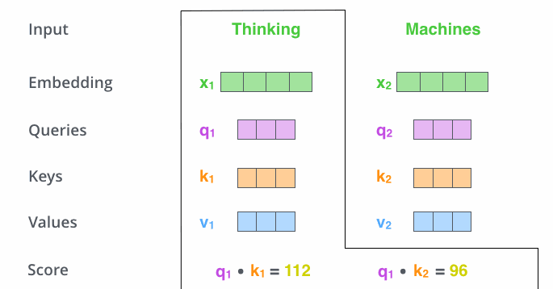

有了 Query 和 Key，就可以给词与词之间打分。第 $i$ 个词看第 $j$ 个词的原始分数是：

$$
score_{ij} = q_i \cdot k_j
$$

这里的点积可以展开成：

$$
q_i \cdot k_j = \sum_{r=1}^{d_k} q_{i,r}k_{j,r}
$$

点积还有一个几何解释：

$$
q_i \cdot k_j = \|q_i\|\|k_j\|\cos\theta
$$

如果两个向量方向接近，夹角 $\theta$ 小，$\cos(\theta)$ 大，点积就大；如果方向相反或无关，点积就小。模型利用这个性质，把“问题”和“标签”方向是否匹配转成一个数字分数。

这一步背后的思想很朴素：如果 `it` 的 Query 和 `animal` 的 Key 在训练后形成了相近方向，那么 `it` 就会更关注 `animal`。

更关注 `animal` 之后，真正发生的联动是：`animal` 的 Value 会被乘上更大的注意力权重，然后加入到 `it` 这个位置的新向量里。也就是说，`animal` 不是把文字“动物”直接塞给 `it`，而是把自己的 Value 向量按比例贡献给 `it` 的新表示。

用符号写，假设当前要更新的是 `it` 这个位置：

$$
z_{\text{it}}=\sum_j \alpha_{\text{it},j}v_j
$$

这里 $\alpha_{\text{it},j}$ 表示 `it` 分给第 $j$ 个词的注意力比例，$v_j$ 是第 $j$ 个词的 Value。若 `animal` 的权重最大，$v_{\text{animal}}$ 在求和里占的比例就最大：

$$z_{\text{it}}=
\alpha_{\text{it},\text{animal}}v_{\text{animal}}
+\alpha_{\text{it},\text{street}}v_{\text{street}}
+\alpha_{\text{it},\text{tired}}v_{\text{tired}}
+\cdots
$$

举一个教学用的小数字例子。假设 `it` 对三个词的注意力分配是：

$$
\alpha_{\text{it},\text{animal}}=0.70,\quad
\alpha_{\text{it},\text{street}}=0.10,\quad
\alpha_{\text{it},\text{tired}}=0.20
$$

再假设这三个词的 Value 向量是：

$$
v_{\text{animal}}=[0.60,\ 0.10,\ 0.80]
$$

$$
v_{\text{street}}=[0.20,\ 0.90,\ -0.30]
$$

$$
v_{\text{tired}}=[0.10,\ -0.40,\ 0.70]
$$

那么 `it` 更新后的自注意力输出就是：

$$
z_{\text{it}}
=0.70[0.60,\ 0.10,\ 0.80]
+0.10[0.20,\ 0.90,\ -0.30]
+0.20[0.10,\ -0.40,\ 0.70]
$$

$$
z_{\text{it}}=[0.46,\ 0.08,\ 0.67]
$$

这个 $z_{\text{it}}$ 就是融合了上下文后的 `it`。因为 `animal` 的权重是 0.70，它的 Value 对结果影响最大；`street` 权重只有 0.10，所以它对 `it` 的新表示影响较小。后面再经过残差连接和归一化时，可以简化理解成：

$$
h_{\text{it}}=LayerNorm(x_{\text{it}}+z_{\text{it}})
$$

也就是说，`it` 原来的向量 $x_{\text{it}}$ 没有被直接抹掉，而是在原来的基础上加进了从 `animal`、`tired` 等词那里汇总来的信息。这样下一层再看到 `it` 时，它已经不只是一个孤立代词，而是一个带着“它更可能指 animal，并且和 tired 状态有关”的上下文向量。

## 12. 缩放和 softmax：把任意分数变成可用概率

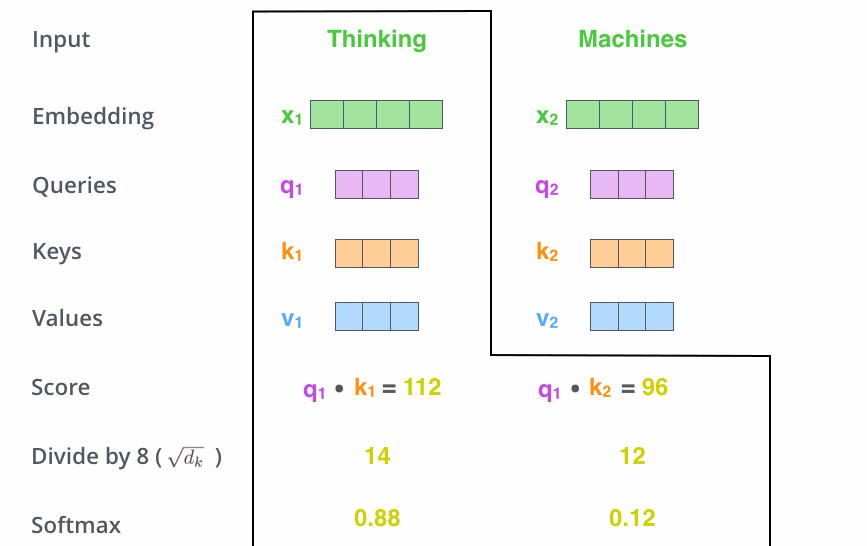

假如模型只需要在两个类别之间分配概率，softmax 会把两个类别的原始分数转换成一组相加为 1 的概率。下图用二分类情况做直观展示：横轴表示类别 A 相对类别 B 的分数差，纵轴表示 softmax 后的输出概率。分数差越偏向 A，A 的概率越高；分数差越偏向 B，B 的概率越高。

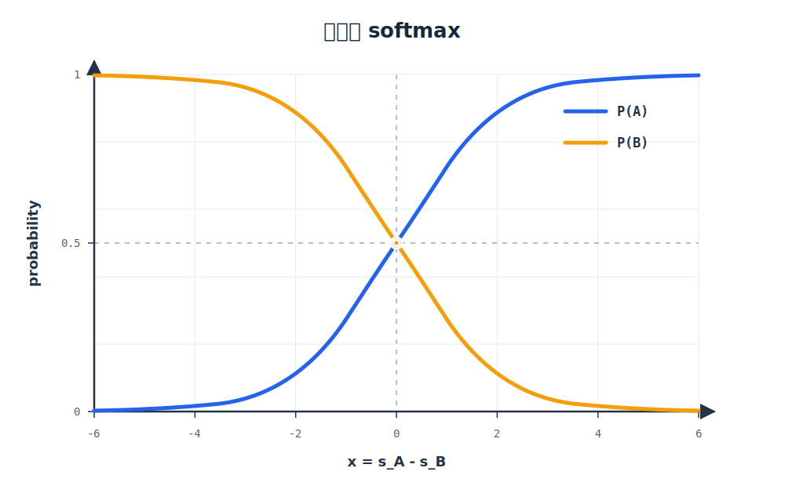

原始分数不能直接当权重，因为它们可能是负数，也可能大小差异过大。Transformer 先把分数除以 $\sqrt{d_k}$，再送进 softmax：

$$
\alpha_{ij} =
\frac{\exp(score_{ij}/\sqrt{d_k})}
{\sum_{m=1}^{n}\exp(score_{im}/\sqrt{d_k})}
$$

softmax 的结果有两个性质：

1. 每个 $\alpha_{ij}$ 都大于 0。
2. 对固定的 $i$，所有 $\alpha_{ij}$ 加起来等于 1。

所以它们可以被当成“注意力分配比例”。例如某个词可能把 0.65 的注意力给自己，0.25 给前面的名词，0.10 分给其他词。

为什么要除以 $\sqrt{d_k}$？假设 $q$ 和 $k$ 的每个维度都大致均值为 0、方差为 1，那么点积是 $d_k$ 个乘积的和，方差会随 $d_k$ 增大。维度越大，分数越容易变得特别大或特别小。softmax 遇到极端分数时会非常接近 0 或 1，梯度会变小，训练不稳定。除以 $\sqrt{d_k}$ 后，分数的尺度更稳定。

这个缩放不是玄学，而是为了让 softmax 不要过早变成“几乎只选一个词”的硬选择。

顺便把“模型怎么学会这些权重”说清楚。最简单的可学习模型可以写成：

$$
\hat{y}=ax+b
$$

这里 $x$ 是输入，$\hat{y}$ 是模型预测值，$a$ 和 $b$ 是模型要学习的参数。假设真实答案是 $y$，预测错了多少可以用一个损失函数表示，例如平方误差：

$$
L=(\hat{y}-y)^2
$$

训练的目标就是让 $L$ 变小。怎么知道 $a$ 和 $b$ 应该往哪个方向调？靠导数。导数告诉我们：如果稍微增大 $a$，损失会变大还是变小；如果稍微增大 $b$，损失会变大还是变小。

对 $a$ 和 $b$ 求导后，可以按梯度下降更新：

$$
a \leftarrow a-\eta\frac{\partial L}{\partial a}
$$

$$
b \leftarrow b-\eta\frac{\partial L}{\partial b}
$$

$\eta$ 是学习率，可以理解成每次调整参数时迈多大一步。如果导数为正，说明参数继续变大会让损失变大，于是更新时减小它；如果导数为负，说明参数变大可能让损失变小，于是减去负数等于增大它。

Transformer 的训练原理也是这个思路，只是参数数量从 $a$、$b$ 两个数变成了大量矩阵和向量。比如词嵌入表 $E$、生成 Query 的 $W^Q$、生成 Key 的 $W^K$、生成 Value 的 $W^V$、多头注意力后的 $W^O$、前馈网络里的 $W_1$ 和 $W_2$、最后输出词表概率的线性层权重，都是可学习参数。

需要稍微区分一下：$W^Q$、$W^K$、$W^V$ 是真正被训练更新的参数矩阵；而某一次输入句子算出来的 $Q$、$K$、$V$ 通常是中间结果，不是直接存下来长期学习的参数。它们由输入向量乘以参数矩阵得到：

$$
Q=XW^Q,\quad K=XW^K,\quad V=XW^V
$$

如果模型最后预测错了，损失函数会沿着计算链条一路反向传回去：从输出概率传到解码器，再传到注意力层、前馈网络、Q/K/V 投影矩阵和词嵌入表。反向传播会计算每个参数对错误的影响，然后用类似上面更新 $a$、$b$ 的方式更新这些矩阵。

所以可以把整篇文章里的训练过程理解成：模型先用当前参数算出预测结果，再用损失函数衡量错了多少，然后用导数找到每个参数该往哪里调整，最后一点点更新参数。经过大量句子反复训练后，Q/K/V 矩阵就会学会怎样找关系，词嵌入会学会怎样表示词义，前馈网络会学会怎样加工上下文信息。

## 13. 加权求和：把相关词的信息混进当前词

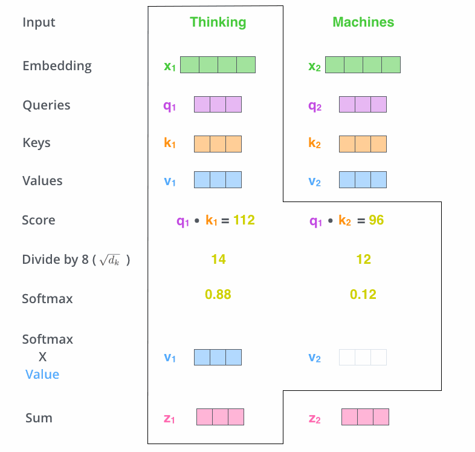

得到注意力权重后，就用它们对 Value 向量做加权求和：

$$
z_i = \sum_{j=1}^{n} \alpha_{ij}v_j
$$

$z_i$ 就是第 $i$ 个词经过自注意力之后的新表示。它不是某个单独词的 Value，而是整句话中所有 Value 的混合，只是重要词占比更大。

可以用一个小例子理解。假设处理 `it` 时，模型给 `animal` 的权重是 0.6，给 `tired` 的权重是 0.25，给其他词总共 0.15。那么新的 `it` 向量会主要吸收 `animal` 的信息，也吸收一部分 `tired` 的状态信息。这样下一层再处理 `it` 时，已经带着上下文了。

注意，自注意力不会真的输出“it 指 animal”这句文字。它输出的是一个数字向量。但这个向量在后续任务中会表现得像是“理解了这种关系”。

## 14. 矩阵形式：一次算完整句话

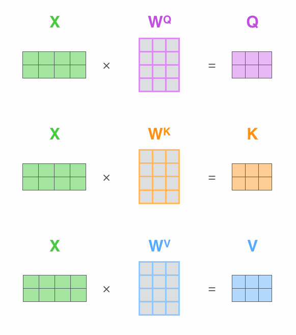

真实实现不会手工对每个词重复计算，而是用矩阵批量完成。设：

$$
X \in \mathbb{R}^{n \times d_{model}}
$$

$$
W^Q, W^K, W^V \in \mathbb{R}^{d_{model} \times d_k}
$$

那么：

$$
Q,K,V \in \mathbb{R}^{n \times d_k}
$$

$X$ 的每一行是一个词向量。乘以 $W^Q$ 后，每一行变成该词的 Query；乘以 $W^K$ 后，每一行变成该词的 Key；乘以 $W^V$ 后，每一行变成该词的 Value。

矩阵计算的好处是快。它把很多重复的小计算合成少数几个大矩阵乘法，而 GPU、TPU 这类硬件非常擅长做矩阵乘法。

## 15. 自注意力公式的完整形态

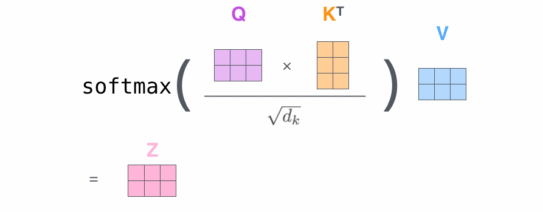

自注意力的矩阵公式是：

$$
Attention(Q,K,V) = softmax\left(\frac{QK^T}{\sqrt{d_k}}\right)V
$$

逐项看：

$QK^T$ 的形状是：

$$
(n \times d_k)(d_k \times n) = n \times n
$$

它得到的是每个词对每个词的原始关注分数。第 $i$ 行第 $j$ 列就是 $q_i$ 和 $k_j$ 的点积分数。

除以 $\sqrt{d_k}$ 是缩放。softmax 对每一行做归一化，让每一行变成“第 $i$ 个词如何分配注意力”。最后乘以 $V$：

$$
(n \times n)(n \times d_k) = n \times d_k
$$

得到每个词新的上下文表示。

这一行公式其实包含了完整逻辑：比较关系、稳定分数、变成比例、混合信息。Transformer 的很多力量都来自这个简洁但高效的计算。

## 16. 多头注意力：让模型从多个角度理解关系

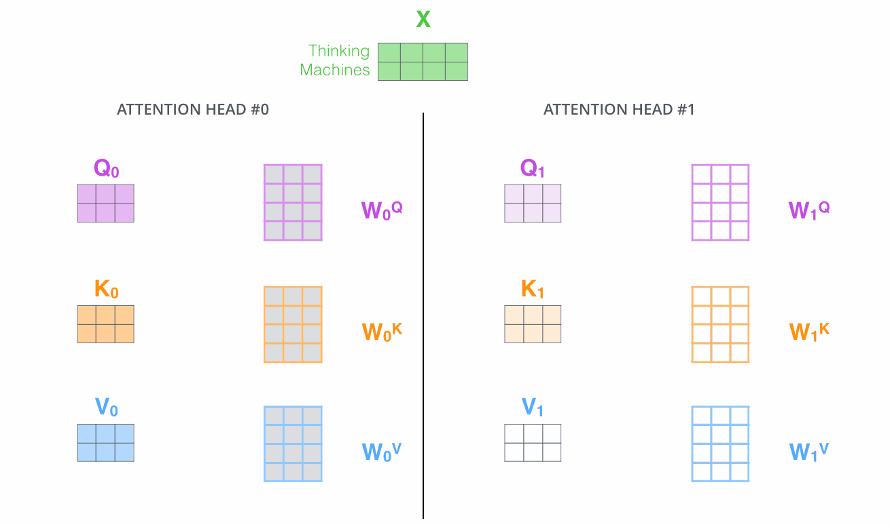

单个注意力头只能用一套 Q、K、V 规则看句子。多头注意力会准备多套规则，让模型从多个表示空间中观察同一句话。

第 $h$ 个头可以写成：

$$
head_h = Attention(XW_h^Q, XW_h^K, XW_h^V)
$$

原始 Transformer 使用 8 个头，$d_{model}=512$，通常每个头的 $d_k=d_v=64$。这样每个头看的是 64 维子空间，8 个头合起来仍然是 512 维。

为什么多头有用？语言关系不是单一的。一个词可能需要同时关心主谓关系、代词指代、形容词修饰、长距离依赖、标点结构等。一个头可以偏向某类关系，另一个头可以偏向另一类关系。模型不会被人工规定每个头负责什么，但训练会推动不同头学出有用的分工。

## 17. 多个头会产生多个输出

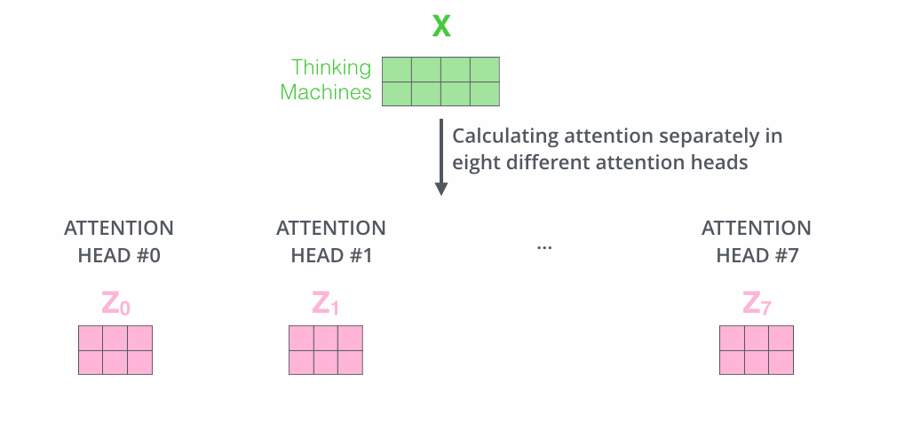

如果有 8 个注意力头，同一句话会得到 8 组注意力输出：

$$
head_1, head_2, ..., head_8
$$

每个头的输出形状大致是：

$$
n \times 64
$$

每一组输出都是从一个角度整理过的上下文信息。比如某个头可能让 `it` 关注 `animal`，另一个头可能让 `it` 关注 `tired`。这不是重复劳动，而是并行提取不同类型的关系。

如果只保留一个头，模型被迫把所有关系压进同一种注意力模式里；多头相当于给模型更多“观察镜头”。

这些头的结构确实一样，但参数不是同一份。第 1 个头有自己的 $W_1^Q$、$W_1^K$、$W_1^V$，第 2 个头有自己的 $W_2^Q$、$W_2^K$、$W_2^V$，依此类推。也就是说，它们的“计算流程”一样，但“镜片参数”不同。

训练刚开始时，这些权重通常会随机初始化成不同的数。这个初始差异会让不同头一开始看到的特征略有不同。随后在训练过程中，每个头输出的信息会通过后面的 $W^O$、前馈网络和最终损失函数影响预测结果。反向传播会根据每个头对最终错误的贡献，分别调整它们自己的参数。

所以多个头最后学到的权重不一样，原因可以概括成两点：第一，初始权重通常不同；第二，每个头有独立参数，训练中收到的梯度更新也会不同。久而久之，有的头可能更擅长看指代关系，有的头可能更擅长看相邻词，有的头可能关注语法结构。模型没有被明确规定“第几个头必须学什么”，这种分工是在训练中自然形成的。

## 18. 拼接和输出矩阵：把多个视角合成一个向量

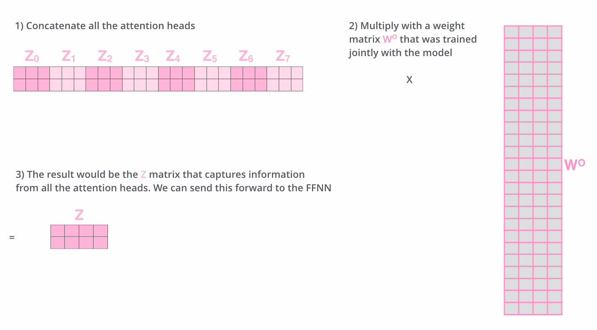

多个头的结果不能直接丢给下一层，因为下一层通常期望每个词仍然是 $d_{model}$ 维。于是模型先拼接所有头：

$$
Concat(head_1,\ldots,head_8) \in \mathbb{R}^{n \times 512}
$$

然后再乘以一个输出权重矩阵：

$$
MultiHead(X)=Concat(head_1,\ldots,head_8)W^O
$$

这里的 $W^O$ 可以理解成一个常说的全连接层，也就是线性层。对每个词的位置来说，前面 8 个头拼接后形成一个长向量，乘以 $W^O$ 就是在这个长向量的所有维度之间做一次加权组合。

但要注意，它只是多头注意力最后的“输出投影层”，不等于整个多头注意力。词与词之间的信息交换已经在前面的注意力计算里发生了；$W^O$ 主要负责把多个头的结果重新混合成下一层需要的维度。它也不是把整句话的所有 token 展平成一个大向量再做全连接，而是对每个 token 的表示分别使用同一套 $W^O$。

$W^O$ 的作用不是简单压缩，而是学习如何融合不同头的信息。如果某个任务中指代关系更重要，模型可以学会让相关头的信息在融合时占更大作用；如果某些头在某些位置不重要，也可以被弱化。

可以把拼接看成把多份观察记录放到一起，把 $W^O$ 看成总编辑规则，决定怎么组织成下一层能继续使用的统一报告。

## 19. 多头注意力的整体图景

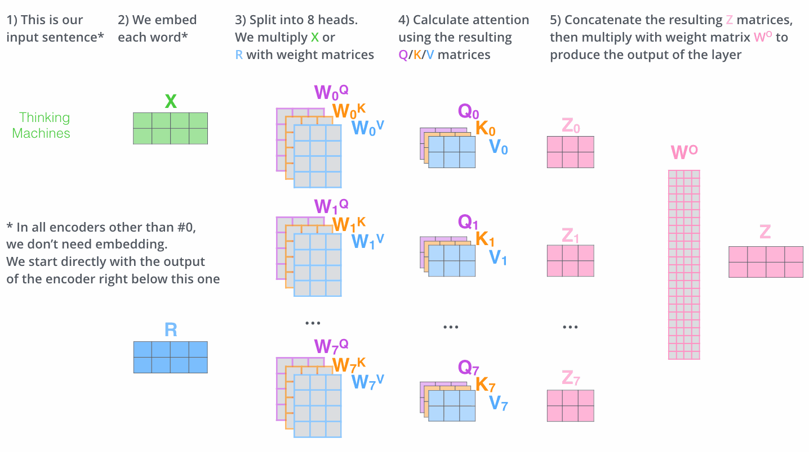

完整多头注意力看起来矩阵很多，但可以压缩成三层逻辑。

第一层，把输入 $X$ 投影成多组 Q、K、V。第二层，每组 Q、K、V 独立做自注意力，得到多个头的结果。第三层，把多个头拼接起来，再通过 $W^O$ 融合。

公式写成：

$$
MultiHead(Q,K,V)=Concat(head_1,\ldots,head_h)W^O
$$

$$
head_i=Attention(QW_i^Q,KW_i^K,VW_i^V)
$$

在编码器自注意力中，$Q$、$K$、$V$ 都来自同一个输入 $X$。后面讲解码器的编码器-解码器注意力时，$Q$ 会来自解码器，$K$ 和 $V$ 会来自编码器输出。

## 20. 注意力头真的会学到不同关注模式

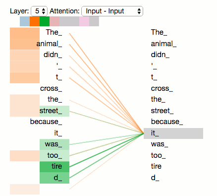

原文展示了一个直观现象：处理 `it` 时，不同注意力头可能关注不同词。一个头关注 `The animal`，另一个头关注 `tired`。

这说明多头注意力不是单纯增加参数数量。它给模型提供了并行建模不同关系的能力。对于 `it` 这个词，只知道它指向 `animal` 还不够，还要知道为什么后面说 `tired`。一个向量要承担多种语义信息，多头可以让这些信息从不同路径进入。

这里要注意，注意力可视化不能被过度解释。某条线很粗，表示权重大，不一定意味着模型像人一样“理解了原因”。但从机制上看，权重确实决定了信息流向：权重越大，对应 Value 对输出向量的贡献越大。

## 21. 所有头一起看会很复杂

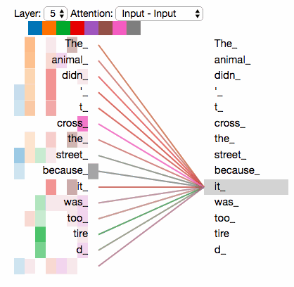

如果把所有注意力头、所有词之间的关注线都画出来，图会变得很复杂。这正是 Transformer 强大也难解释的地方：它不是只学一条简单规则，而是在大量位置之间建立许多软连接。

“软连接”是关键。自注意力不是只能选一个词，而是给所有词分配连续权重。这样模型既可以重点看一个词，也可以同时吸收多个词的信息。语义往往不是单点决定的，句子理解经常依赖多个线索共同作用。

数学上，这种软连接来自 softmax 权重 $\alpha_{ij}$。只要权重不是严格 0，某个词的信息就会以一定比例进入当前词。模型用连续可导的权重，而不是硬规则，是因为连续可导的函数可以通过梯度下降训练。

## 22. 位置编码：让模型知道词的顺序

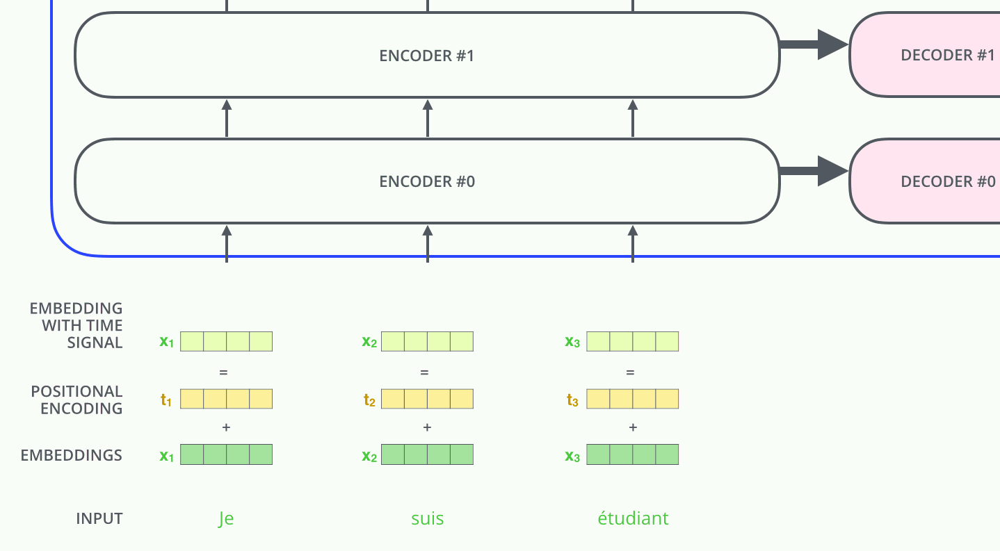

自注意力本身有一个问题：如果不加入位置信息，它对词序不敏感。矩阵里的词可以互相看，但模型需要知道谁在前、谁在后。

例如“狗咬人”和“人咬狗”用到的词相同，但意思完全不同。只给词向量，模型知道有 `狗`、`咬`、`人`，却缺少顺序。位置编码就是给每个词加上一组表示位置的数字：

$$
input_i = embedding_i + positional\_encoding_i
$$

这样第 1 个位置的 `dog` 和第 3 个位置的 `dog` 虽然词向量相同，但加上位置编码后输入不同。

为什么用加法而不是拼接？加法保持向量维度不变，后续结构不用改变；同时模型可以在同一向量空间里同时使用词义和位置。只要位置编码有规律，后面的线性变换和注意力就能学会利用它。

## 23. 小尺寸例子：位置也是一串数字

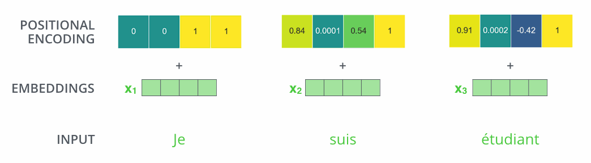

如果词向量只有 4 维，位置编码也可以是 4 维。第一个词加第一行位置编码，第二个词加第二行位置编码，依此类推。

假设某个词向量是：

$$
[0.2,\ 0.5,\ -0.1,\ 0.7]
$$

它在第 3 个位置的位置编码是：

$$
[0.14,\ -0.99,\ 0.03,\ 1.00]
$$

加起来得到：

$$
[0.34,\ -0.49,\ -0.07,\ 1.70]
$$

这个新向量同时包含“它是什么词”和“它在第几个位置”。模型不需要单独拿一个字段记录位置，位置已经混进输入向量里。

## 24. 正弦余弦位置编码：用不同频率记录远近关系

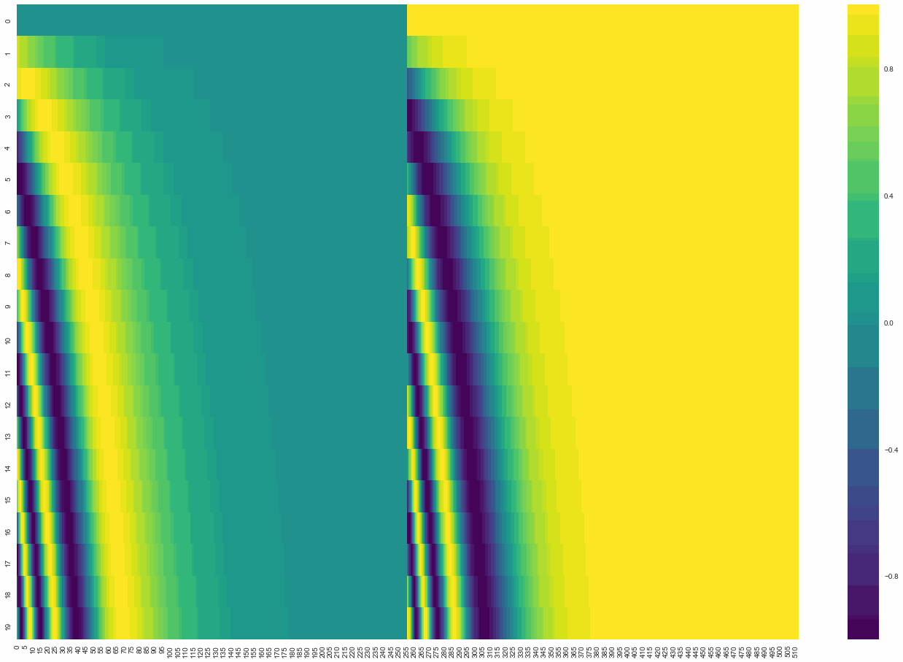

原始论文使用正弦和余弦函数生成位置编码。常见写法是：

$$
PE(pos,2i)=\sin\left(\frac{pos}{10000^{2i/d_{model}}}\right)
$$

$$
PE(pos,2i+1)=\cos\left(\frac{pos}{10000^{2i/d_{model}}}\right)
$$

$pos$ 是位置编号，$i$ 是维度编号。不同维度使用不同频率的波。低维可能变化快，高维可能变化慢。这样一个位置会被编码成多种频率下的组合信号。

为什么这有助于表示相对位置？三角函数有一个重要性质：

$$
\sin(a+b)=\sin a\cos b+\cos a\sin b
$$

$$
\cos(a+b)=\cos a\cos b-\sin a\sin b
$$

这意味着“位置 $pos+k$ 的编码”可以由“位置 $pos$ 的正弦余弦值”和“偏移 $k$ 的正弦余弦值”线性表示出来。模型后面的线性层比较擅长学习线性组合，因此这种编码天然适合表达相对距离。

这里说的“线性层”不是特指第 18 章里的 $W^O$，而是泛指 Transformer 里反复出现的线性变换。比如生成 Query、Key、Value 的 $W^Q$、$W^K$、$W^V$，多头注意力最后的 $W^O$，以及前馈网络里的 $W_1$、$W_2$，本质上都在做“把输入向量的各个维度按权重重新组合”。位置编码用了正弦和余弦后，这些线性变换更容易从编码里学出“相隔 $k$ 个位置”这类关系。

图中像彩色纹理一样的模式，就是不同位置在不同频率维度上的数值变化。

## 25. 论文版和实现版的细节差异

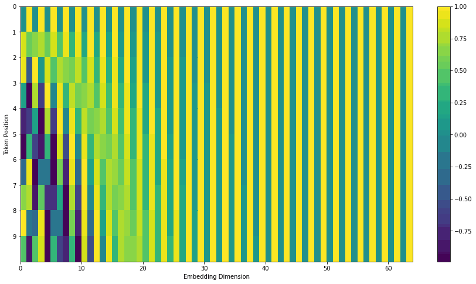

这张图不是在说 Tensor2Tensor 的实现，而是在展示原论文里的位置编码排布方式。原文的意思是：前面第 24 节那张看起来“左半边一类纹理、右半边一类纹理”的位置编码图，来自 Tensor2Tensor 对 Transformer 的实现；而原论文《Attention Is All You Need》里的排布略有不同，所以作者又放了这一张图来对比。

两者核心计算思想一样，都是用正弦和余弦给每个位置生成一串数字。差别在于这些数字在向量维度里怎么摆放。Tensor2Tensor 图里更像是把一批 sine 信号放在左半边，再把一批 cosine 信号放在右半边；论文版则是交错摆放：

$$
\text{第 0 维：sine， 第 1 维：cosine， 第 2 维：sine， 第 3 维：cosine，依此类推}
$$

所以第 25 节这张图可以理解成“论文版位置编码长什么样”。横向仍然是向量维度，纵向仍然是词的位置，颜色深浅表示该位置、该维度上的数值大小。它不是新的机制，只是在告诉读者：实现版图和论文版图看起来有点不一样，是因为 sine/cosine 信号排列顺序不同。

这类差异不改变核心思想。关键不是“必须长成某一张图”，而是位置编码要满足两点：

1. 不同位置有不同编码。
2. 编码之间有规律，模型能推断位置远近。

后来很多模型还使用可学习位置编码、相对位置编码、RoPE 等方法。它们都在解决同一个问题：Transformer 需要知道顺序，否则注意力只知道词之间有关联，不知道它们站在句子的哪里。

## 26. 残差连接和层归一化：让深层模型稳定训练

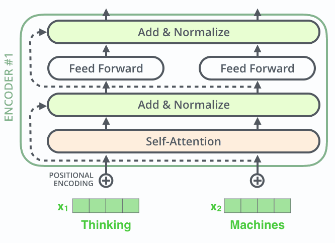

编码器中的每个子层外面都有残差连接，并且后面接层归一化。常见形式可以写成：

$$
y = LayerNorm(x + Sublayer(x))
$$

这里 $Sublayer(x)$ 可以是自注意力，也可以是前馈网络。$x + Sublayer(x)$ 就是残差连接。

残差连接的作用是保留原始信息通道。没有残差时，信息必须完全穿过每个子层。如果层数很深，早期信息和梯度都可能在多次变换中变弱。残差让模型至少可以学到“在原输入基础上做增量修改”，而不是每层都从零重写。

从优化角度看，残差结构让模型更容易学习接近恒等映射的函数。如果某一层暂时没有学到有用变换，它可以让 $Sublayer(x)$ 接近 0，于是输出接近 $x$。这会让深层网络更容易训练。

## 27. 层归一化的数学含义

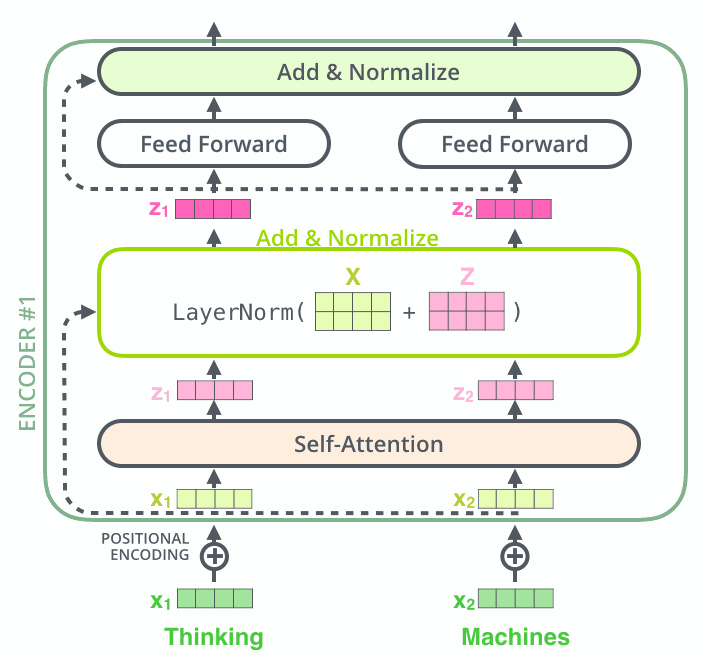

层归一化会对同一个样本、同一个位置的向量内部做标准化。给定向量 `a`，先算均值和方差：

$$
\mu = \frac{1}{d}\sum_{r=1}^{d}a_r
$$

$$
\sigma^2 = \frac{1}{d}\sum_{r=1}^{d}(a_r-\mu)^2
$$

然后输出：

$$
LayerNorm(a)_r = \gamma_r\frac{a_r-\mu}{\sqrt{\sigma^2+\epsilon}}+\beta_r
$$

这里 $\gamma$ 和 $\beta$ 是可学习参数，$\epsilon$ 是防止除以 0 的小数。

为什么要这样做？因为神经网络每层输出的数字范围可能不断变化。如果某层输出过大，后面的 softmax 或激活函数可能进入不稳定区域；如果过小，信号可能弱。归一化把数值尺度拉回比较稳定的范围，再允许模型用 $\gamma$ 和 $\beta$ 学会合适的缩放和平移。

可以把它理解成：每次加工完，都先把数字整理到合适尺度，再交给下一步。

## 28. 整个 Transformer 层是重复的稳定加工流程

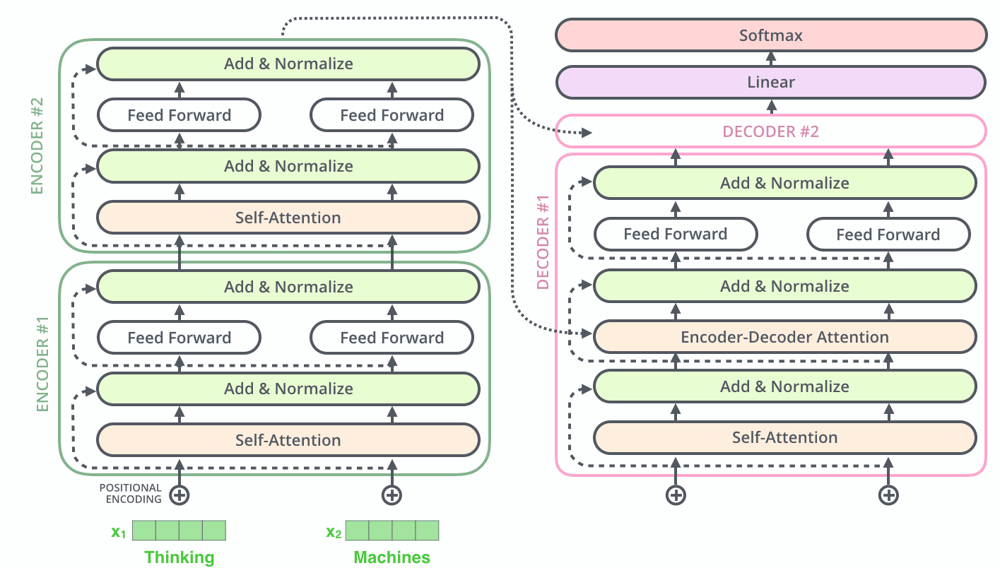

把编码器和解码器堆叠起来后，可以看到同样的模式反复出现：注意力或前馈网络负责变换信息，残差连接保留原信息，层归一化稳定数值。

一层编码器更完整地写，可以近似表示为：

$$
U = LayerNorm(X + MultiHeadAttention(X))
$$

$$
Y = LayerNorm(U + FFN(U))
$$

这两行说明了 Transformer 的层级结构。第一行让每个词吸收上下文，第二行对每个词的上下文表示做非线性加工。多层重复后，词向量里的信息会越来越丰富。

解码器也类似，只是中间多一层看编码器输出的注意力。

## 29. 编码器输出如何交给解码器

编码器读完整个输入句子后，最上层输出会被解码器使用。更具体地说，在编码器-解码器注意力中，解码器会从自己的当前状态生成 Query，而 Key 和 Value 来自编码器输出。

可以写成：

$$
Q = Y_{decoder}W^Q
$$

$$
K = H_{encoder}W^K,\quad V = H_{encoder}W^V
$$

这和自注意力的差别在于来源不同。编码器自注意力里，Q、K、V 都来自输入句子自身。编码器-解码器注意力里，Q 来自目标端当前要生成的位置，K 和 V 来自源句子的编码结果。

直观地说，解码器拿着“我现在要写什么”的问题，去编码器整理好的原文资料里找答案。这样生成每个目标词时，都可以动态关注输入句子的不同部分。

## 30. 解码是自回归的，不能偷看未来

解码器生成句子时是一词一词来的。第 1 步生成第一个词，第 2 步基于第一个词生成第二个词，直到生成结束符。

训练时我们通常已经知道完整目标句子，但解码器仍然不能看到未来词。否则它训练时会作弊，实际生成时却没有未来答案可看。为了解决这个问题，解码器自注意力会加掩码。

掩码可以写成一个矩阵 $M$。对于当前位置 $i$，如果 $j > i$，说明第 $j$ 个词在未来，就把分数设成负无穷：

$$
score_{ij} =
\begin{cases}
q_i \cdot k_j / \sqrt{d_k}, & j \le i \\
-\infty, & j > i
\end{cases}
$$

softmax 遇到 $-\infty$ 后，对应概率会变成 0。于是当前位置只能关注自己和过去位置，不能关注未来。

这种逐步预测的方式叫自回归。许多文本生成模型都是这样工作的：不断根据已有上下文预测下一个 token。

## 31. 最后的 Linear 和 softmax：从向量变成单词

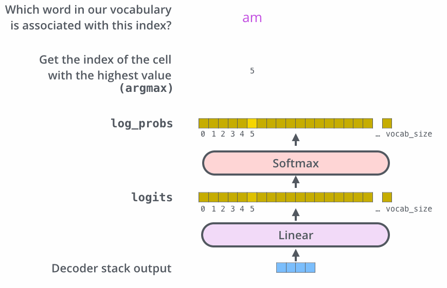

解码器最后输出的仍然是向量，不是单词。要把向量变成词，需要经过一个线性层和 softmax。

设最后某个位置的解码器输出是 $o_t$，线性层计算：

$$
logits_t = o_tW_{vocab}+b
$$

如果词表大小是 $V$，那么 $logits_t$ 长度就是 $V$。第 $r$ 个数字表示第 $r$ 个词的原始分数。然后 softmax 把它变成概率：

$$
p(y_t=r)=\frac{\exp(logits_{t,r})}{\sum_{m=1}^{V}\exp(logits_{t,m})}
$$

概率最高的词通常会被选为当前输出。这里的 `logits` 不是概率，因为它们可以是负数，也不要求加起来等于 1。softmax 之后才是概率分布。

这一步把模型内部的连续向量空间，连接回人类能读的离散词表。

## 32. 词表：模型能输出的候选集合

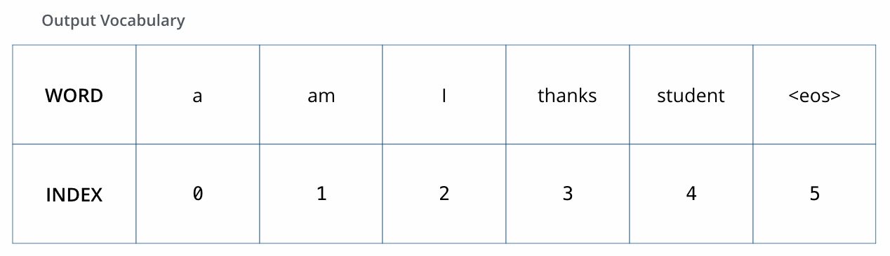

模型在训练前需要定义词表。词表就是模型认识并能输出的候选单位集合。原文用一个只有 6 个词的小词表举例：`a`、`am`、`i`、`thanks`、`student` 和结束符。

真实模型的词表通常不是简单的英文单词表，而是 token 表。一个 token 可能是一个词，也可能是词的一部分，甚至可能是标点或空格组合。这样可以处理没见过的新词，也能控制词表大小。

词表大小直接决定最后 softmax 的维度。如果词表有 50,000 个 token，每次预测下一个 token 时，模型都要给这 50,000 个候选打分。

所以语言模型每一步输出的本质是一个选择问题：在整个词表里，哪个 token 最适合接在当前上下文后面？

## 33. One-hot：正确答案的数字形式

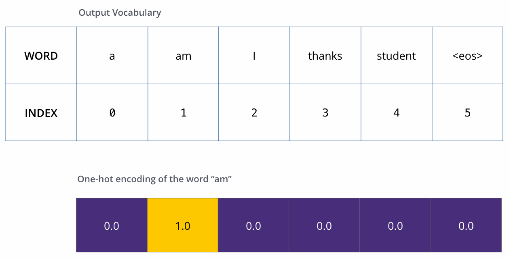

训练时需要告诉模型正确答案是什么。对于分类问题，常用 one-hot 向量表示正确词。

如果词表是：

$$
[a,\ am,\ i,\ thanks,\ student,\ <eos>]
$$

正确词是 `am`，那么目标向量就是：

$$
[0,\ 1,\ 0,\ 0,\ 0,\ 0]
$$

这个向量的长度等于词表大小，只有正确词所在位置是 1，其他位置是 0。

模型输出的是概率分布，例如：

$$
[0.05,\ 0.70,\ 0.10,\ 0.05,\ 0.05,\ 0.05]
$$

训练的目标就是让模型输出的概率分布尽量接近 one-hot 目标。对于正确词 `am`，我们希望它的概率越接近 1 越好。

## 34. 损失函数：用交叉熵惩罚错误概率

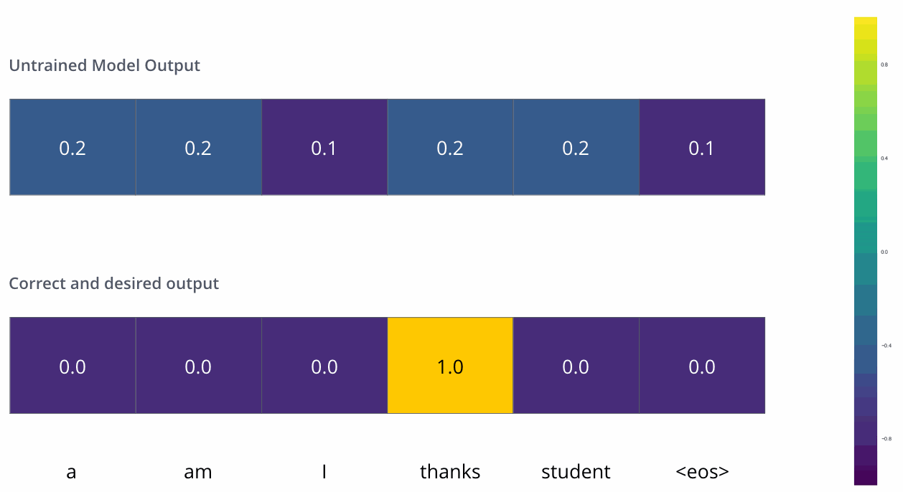

模型刚开始训练时，权重通常接近随机，所以输出概率也接近乱猜。我们需要一个数来衡量“错得有多严重”，这个数就是损失。

分类任务常用交叉熵：

$$
L = -\sum_{r=1}^{V} y_r \log p_r
$$

$y_r$ 是目标分布，$p_r$ 是模型预测概率。如果目标是 one-hot，只有正确词 $c$ 的 $y_c=1$，其他都是 0，那么交叉熵会简化成：

$$
L = -\log p_c
$$

这个公式非常关键。它说明训练时真正惩罚的是“正确词概率不够高”。如果模型给正确词概率 0.9，损失是：

$$
-\log(0.9) \approx 0.105
$$

如果只给 0.01，损失是：

$$
-\log(0.01) \approx 4.605
$$

概率越小，惩罚越大，而且是非线性变大。这样模型会被强烈推动去提高正确词的概率。

训练通过反向传播计算损失对每个参数的影响，再用梯度下降类方法更新参数：

$$
\theta \leftarrow \theta - \eta \nabla_\theta L
$$

$\theta$ 表示所有可训练参数，$\eta$ 是学习率。模型所谓“学习”，就是不断用这个过程调整嵌入、注意力权重、前馈网络权重等。

## 35. 长句训练：每个时间步都有一个正确答案

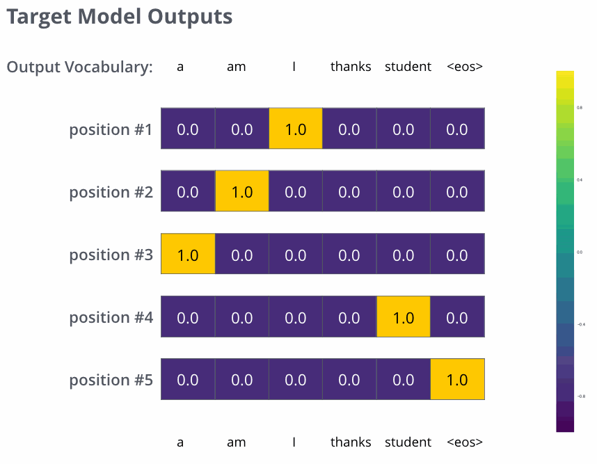

真实翻译不是只输出一个词，而是输出一串词。比如输入 `je suis étudiant`，目标输出可能是 `i am a student <eos>`。

训练时，每个输出位置都有一个目标分布：

$$
L_{total} = \sum_{t=1}^{T} -\log p(y_t^{true} \mid y_{<t}^{true}, X)
$$

这里 $T$ 是目标序列长度。第 1 个位置希望模型给 $i$ 高概率，第 2 个位置希望给 `am` 高概率，第 3 个位置希望给 `a` 高概率，依此类推。

训练时常用 teacher forcing，也就是把真实的前文喂给解码器，让它学习在正确上下文下预测下一个词。例如训练第 3 个词时，输入给解码器的前文是正确的 `i am`，而不是模型自己前两步可能猜错的结果。

这样做能让训练更稳定，因为每个位置都能直接学习“正确前文下，下一个词应该是什么”。

## 36. 训练后如何生成：贪心解码和 Beam Search

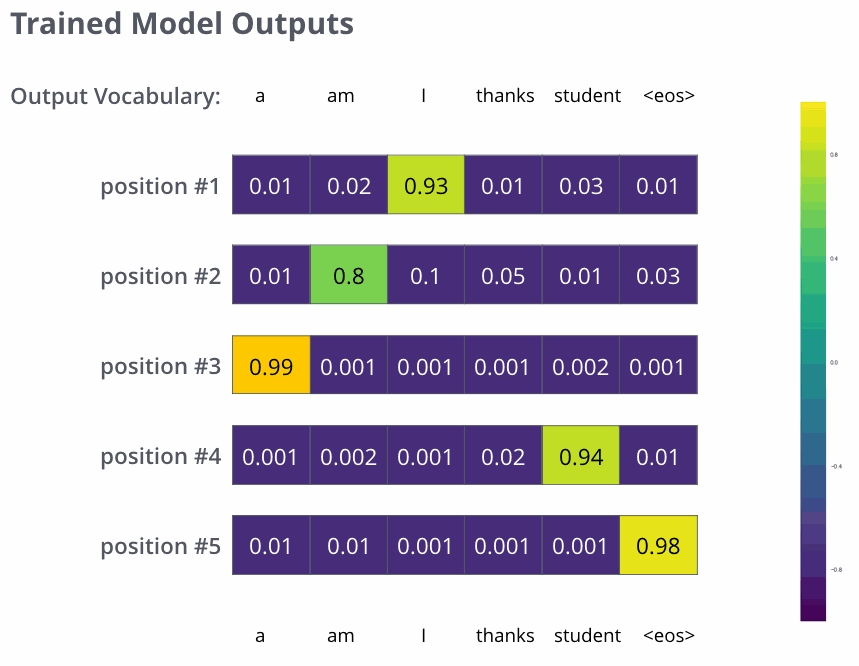

训练充分后，模型在每个位置应该给正确词较高概率。真正生成时，没有标准答案可喂，只能用模型已经生成的词继续往后预测。

最简单的方法是贪心解码：每一步都选当前概率最高的 token。

$$
y_t = \arg\max_r p(y_t=r \mid y_{<t}, X)
$$

贪心解码速度快，但它只看当前一步最优，不保证整句最优。比如第一步概率最高的词可能导致后面句子别扭，而第二高的词可能让整体翻译更好。

Beam Search 会同时保留 $B$ 条候选序列。每一步扩展这些候选，并按累计 log 概率排序：

$$
score(y_{1:T}) = \sum_{t=1}^{T} \log p(y_t \mid y_{<t}, X)
$$

为什么用 log 概率？因为整句概率是每一步概率相乘：

$$
P(y_{1:T}) = \prod_{t=1}^{T} p(y_t \mid y_{<t}, X)
$$

很多小数相乘会越来越小，也不方便计算。取 log 后，乘法变加法：

$$
\log P(y_{1:T}) = \sum_{t=1}^{T}\log p(y_t \mid y_{<t}, X)
$$

Beam Search 不是真正遍历所有句子，因为可能句子数量太多。它只是保留少量最有希望的路线，在质量和速度之间折中。

## 37. 把 Transformer 的原理串起来

Transformer 可以从一句话理解：

它先把词变成向量，加上位置信息；编码器用自注意力让每个词吸收全句相关信息，再用前馈网络加工；解码器一边看已经生成的目标词，一边通过编码器-解码器注意力查看输入句子；最后用线性层和 softmax 在词表中选择下一个 token；训练时用交叉熵衡量预测分布和正确答案的差距，并通过反向传播调整所有参数。

如果只记机制，核心公式是：

$$
Attention(Q,K,V)=softmax\left(\frac{QK^T}{\sqrt{d_k}}\right)V
$$

如果记直觉，它做了四件事：

1. $QK^T$ 判断每个词应该关注哪些词。
2. `softmax` 把关注分数变成比例。
3. 乘以 $V$ 把相关词的信息混合进来。
4. 多层、多头、残差和归一化让这个过程稳定、丰富、可训练。

Transformer 的强大不在于某个单独魔法，而在于这些设计组合在一起：矩阵并行计算提高效率，自注意力建模长距离关系，多头注意力提供多个观察角度，位置编码补足顺序，残差和归一化稳定深层训练，交叉熵和反向传播让所有参数能从数据中学习。

## 来源与许可

- 原文：Jay Alammar, [The Illustrated Transformer](https://jalammar.github.io/illustrated-transformer/)
- 原文发布日期：2018 年 6 月 27 日
- 图片来源：原文正文配图，下载到 `images/illustrated-transformer/`
- 原文许可：[Creative Commons Attribution-NonCommercial-ShareAlike 4.0 International License](https://creativecommons.org/licenses/by-nc-sa/4.0/)
- 本文为中文学习笔记式改写与讲解，遵循署名、非商业、相同方式共享原则。

